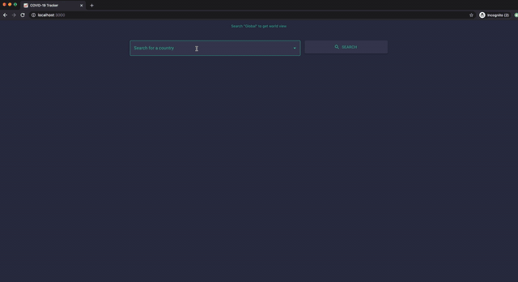

# CoronaTracker

Tracking the movement and trends of the COVID-19 virus.

## Demo



## Installation

This project runs on a React frontend managed by [npm](https://www.npmjs.com/get-npm) and a [Python](https://www.python.org/downloads/release/python-362/) backend routed by Flask.

Use the package manager [pip](https://pip.pypa.io/en/stable/) to install the requirements for the backend component.

```bash
pip install -r requirements.txt
```

Make sure to have node and npm installed on your machine. This frontend component is running on node v10.15.0.

```
node -v
npm -v
```

## Run

In a terminal shell, run the following to start the development server.

```bash
python3.6 backend/server.py
```

In another shell, run the following to start a local instance of the website on your machine.

```bash
cd frontend
npm start
```

## License
[MIT](https://choosealicense.com/licenses/mit/)
