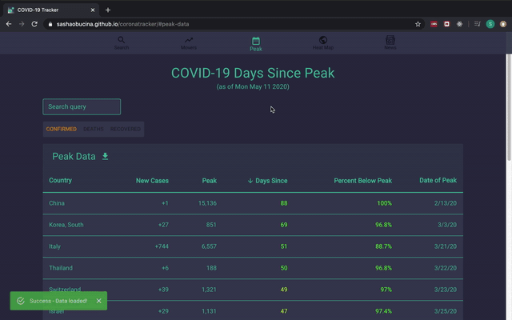

# COVID-19 Coronavirus Tracker

Tracking the trends and movements of the COVID-19 virus. Visit the site [here](https://sashaobucina.github.io/coronatracker/).

The trends of the virus are visualized through interactive graphs and tables that show the movement on a per-country or global basis. These visualizations show:
- The total number of cases (confirmed & deaths)
- The rate of change per day
- The acceleration per day
- The exponential trajectory path

The data is accmulated from the [John Hopkins University CSSE](https://github.com/CSSEGISandData/COVID-19) repository.

Now supporting live news about COVID-19 and travel alerts on a per-country basis!

⭐ If you wish to stay notified, please consider starring this repo! ⭐


## Support the project
<a href="https://www.buymeacoffee.com/sashaobucina" target="_blank"></a>

## Demos

### Country Search


### Top Movers


### Peak Table



### Heat Map


### News


## Usage Locally

This project runs on a React frontend managed by [npm](https://www.npmjs.com/get-npm) and a [Python3](https://www.python.org/downloads/release/python-362/) backend routed by Flask. Alternatively, you can use a [Docker](https://www.docker.com/) container to encapsulate the project.

### Installing

Use the package manager [pip](https://pip.pypa.io/en/stable/) to install the requirements for the backend microservice component:

```bash
cd flask-microservice
virtualenv <your-venv>
source <your-venv>/bin/activate
pip install -r requirements.txt
```

Alternatively, use the provided Docker script to create a Docker container of the project:

```bash
./flask-microservice/docker-init.sh
```

Make sure to have node and npm installed on your machine. This frontend component is running on node v10.15.0.

```bash
node -v
npm -v
```

### Running

In a terminal shell, run the following to start the microservice server.

```bash
python flask-microservice/server.py
```

Alternatively, if built through the Docker container, run the following script:

```bash
./flask-microservice/docker-run.sh
```

In another shell, run the following to start a local instance of the website on your machine.

```bash
cd coronatracker
npm install
npm start
```

## License
[MIT](https://choosealicense.com/licenses/mit/)
